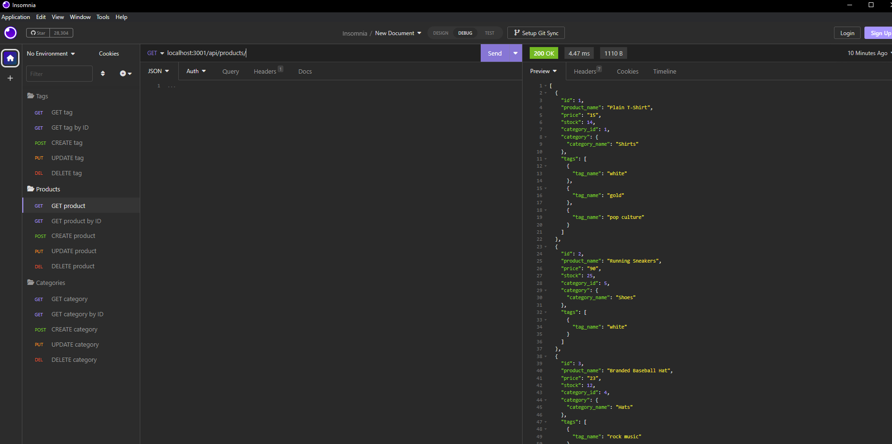

# SQL Backend



## Installation
Install Node and mySQL
Download the repo
```sh
npm i
```
create the .env file and enter your info for
DB_NAME, DB_USER, and DB_PW
open command prompt. Navigate to the db folder in the repo. Start mySQL.
```sh
source schema.sql
```
open a terminal in the root folder. 
```sh
npm run seed
npm start
```


## Usage

[DEMO VIDEO](https://drive.google.com/file/d/1d-Ez9oqWDrrrxnQUJ2ECZDtLRKKNTFUk/view)

If you hit the endpoints in insomnia you will be able to update the date in the ecommerce_db database. 


[Github](https://github.com/LaurenWollaston)